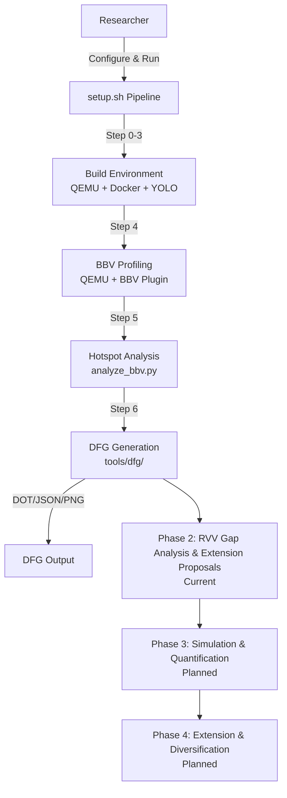
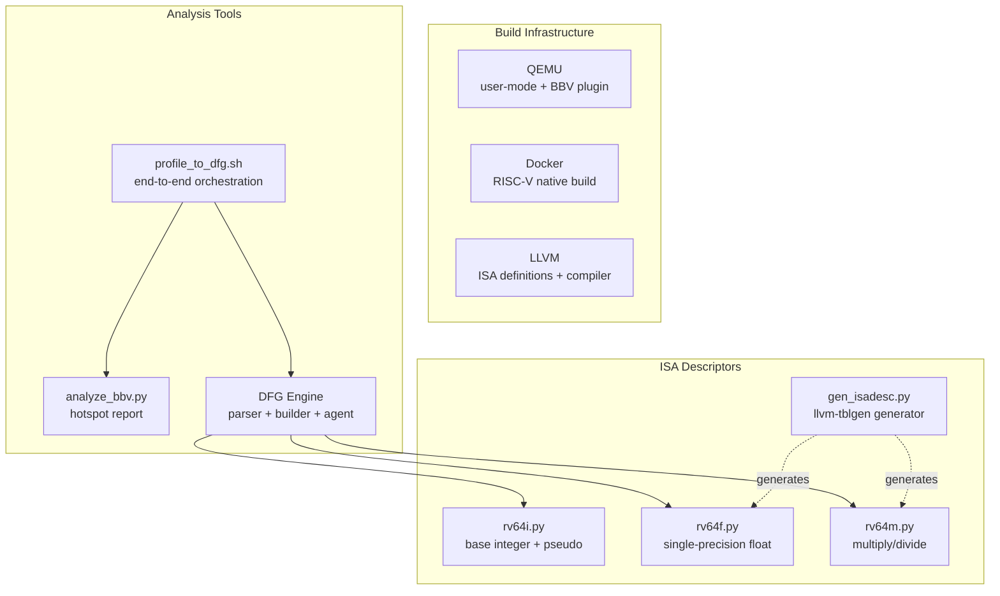
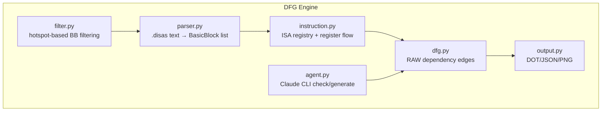

# Software Architecture Design: RVFuse

**Version**: 2.1 | **Date**: 2026-04-08 | **Status**: Active

**Purpose**: This document describes the architecture of RVFuse, a RISC-V vector extension research platform. The project has completed Phase 1 (setup and profiling foundation), and is currently in Phase 2 (cross-platform RVV gap analysis and extension proposals) of a four-phase research roadmap.

---

## Table of Contents

1. Executive Summary
2. Architecture Snapshot
3. System Overview (C4)
4. Deployment Summary
5. Architecture Decisions (ADR Log)
6. Quality Attributes
7. Risks & Technical Debt
8. Agent Checklist

---

## 1. Executive Summary

- **What**: RVFuse is a RISC-V vector extension research platform that profiles applications via QEMU emulation and hardware perf, compares RVV implementations against other platform vector ISAs, and proposes extension instructions with quantified benefits.
- **Why**: RISC-V's modular extension mechanism is naturally suited for custom instruction optimization. Data-driven cross-platform analysis of real workloads provides evidence for extension proposals.
- **Completed Scope**: Repository structure, dependency management, QEMU BBV profiling pipeline, cross-platform vector ISA comparison (RVV vs 6 platforms), BBV+perf quantified extension proposals, RVV-patched ONNX Runtime operators, and a fully automated setup pipeline (`setup.sh` Steps 0-7).
- **Current Scope**: Cross-platform RVV gap analysis and extension proposal design — comparing RVV implementations against other vector ISAs to identify instruction design gaps.
- **Future Scope**: Simulation and benefit quantification; ISA extension (D, C, V) and multi-workload diversification.

### Research Roadmap

| Phase | Goal | Status |
|-------|------|--------|
| 1 | Setup + profiling + DFG generation | Completed |
| 2 | Cross-platform RVV gap analysis and extension proposals | Current |
| 3 | Simulation and benefit quantification | Planned |
| 4 | Extension and diversification (ISA D/C/V, multi-workload) | Planned |

---

## 2. Architecture Snapshot

- **Business Goals**:
  1. Profile real workloads (e.g., YOLO11n inference) to identify hot basic blocks
  2. Compare RVV implementations against other platform vector ISAs
  3. Identify RVV instruction design gaps through cross-platform vector ISA comparison
  4. Propose extension instructions with BBV+perf quantified benefits

- **Constraints**:
  - Development is local-first on Linux x86_64 hosts
  - External repositories are managed as Git submodules (`third_party/`)
  - ISA descriptions are derived from LLVM `.td` files via `llvm-tblgen` for accuracy
  - Agent integration uses Claude Code CLI subprocess with 8+ specialized skills for profiling, compilation, and analysis
  - newlib remains optional (not required for current workloads)

- **Quality Targets**:
  - Full pipeline runnable from `git clone` via `./setup.sh`
  - DFG engine tested with ~1300 lines of unit tests (shelved)
  - ISA register semantics consistent with LLVM backend definitions
  - Cross-platform gap analysis validated against BBV + perf measurements

- **Key Dependencies**:
  - QEMU: https://gitlab.com/qemu-project/qemu (user-mode emulation + BBV plugin)
  - LLVM: https://github.com/llvm/llvm-project (ISA definitions + cross-compiler)

---

## 3. System Overview (C4)

### 3.1 Context



**Context Description**:
- **Researcher**: User who configures and runs the pipeline
- **setup.sh Pipeline**: Orchestrates Steps 0-7 with artifact-based skip detection
- **QEMU + BBV Plugin**: User-mode RISC-V emulation with basic block vector sampling
- **analyze_bbv.py**: Resolves BB addresses to source locations, produces hotspot JSON report
- **DFG Engine**: Parses `.disas` files, builds RAW dependency graphs, supports I/F/M ISA extensions
- **Phases 2-4**: Current and future research work (RVV gap analysis, simulation, diversification)

### 3.2 Containers



**Container Description**:
| Container | Purpose |
|-----------|---------|
| Build Infrastructure | QEMU emulation, Docker cross-build, LLVM toolchain |
| Analysis Tools | BBV hotspot analysis, DFG generation, end-to-end orchestration |
| ISA Descriptors | Per-extension instruction register flow definitions, generated from LLVM `.td` files (DFG engine shelved) |

### 3.3 Components



**Component Responsibilities**:
| Component | Responsibility |
|-----------|---------------|
| parser.py | Read `.disas` text, parse into `BasicBlock` list (address, instruction sequence) |
| instruction.py | `ISARegistry`: lookup mnemonic → `RegisterFlow` (dst/src registers); multi-kind register support (integer, float) |
| dfg.py | Iterate BB instructions, build RAW dependency edges using `last_writer` map |
| output.py | Serialize DFG to DOT (Graphviz), JSON, and PNG formats |
| filter.py | Read BBV hotspot JSON, filter BBs by `--top N` or `--coverage X%` |
| agent.py | Dispatch BB to Claude Code CLI for verification (check) or fallback generation (generate) |

---

## 4. Deployment Summary

- **Runtime**: Local Linux x86_64 workstation
- **Primary Audience**: Researchers analyzing RISC-V instruction fusion opportunities
- **Current Deliverables**: Fully automated pipeline (`setup.sh` Steps 0-7), BBV hotspot analysis, cross-platform RVV gap analysis with 8 agent skills, RVV-patched ONNX Runtime operators (SGEMM, QGEMM, Logistic, QuickGelu, ReduceMinMax, QuantizeLinear)
- **Dependency Access Model**: External toolchain repositories tracked as Git submodules in `third_party/`

**Current Workspace Layout**:
```text
RVFuse/
├── setup.sh               # Pipeline orchestrator (Steps 0-7)
├── prepare_model.sh       # YOLO model export
├── verify_bbv.sh          # QEMU + BBV plugin verification
├── docs/                  # Architecture and design documents
├── docs/
│   ├── plans/             # Design + implementation plans per feature
│   └── architecture.md    # System architecture (this file)
├── memory/                # Project governance
├── tools/
│   ├── analyze_bbv.py     # BBV hotspot analysis (464 lines)
│   ├── profile_to_dfg.sh  # End-to-end profiling → DFG pipeline
│   ├── dfg/               # DFG generation engine (~3400 lines)
│   ├── fusion/            # Fusion pattern discovery (Phase 2)
│   ├── docker-llvm/       # Docker LLVM cross-compilation toolchain
│   └── bbv/               # QEMU BBV plugin
├── applications/          # Test applications
│   └── yolo/              # YOLO inference application
│       ├── runner/        # YOLO inference C++ runner
│       ├── ort/           # Cross-compile ORT v1.24.4 (rv64gcv)
│       ├── ort-c920/      # C920 platform ORT build variant
│       └── patches/       # MLAS RVV patches
├── tests/                 # Integration tests
└── third_party/           # Git submodules
    ├── qemu/              # QEMU (mandatory)
    └── llvm-project/      # LLVM (mandatory)
```

---

## 5. Architecture Decisions (ADR Log)

| ID | Title | Status | Date |
|----|-------|--------|------|
| ADR-001 | Use Git Submodules for External Toolchain Integration | Accepted | 2026-03-31 |
| ADR-002 | Deliver the Project in Stages | Accepted | 2026-03-31 |
| ADR-003 | Keep newlib Optional in the Current Phase | Accepted | 2026-03-31 |
| ADR-004 | Require Traceable Workload References | Accepted | 2026-03-31 |
| ADR-005 | Use llvm-tblgen for ISA Descriptor Generation | Accepted | 2026-04-07 |

### ADR-001: Use Git Submodules for External Toolchain Integration

**Context**: RVFuse depends on upstream toolchain repositories that must remain versionable and attributable.

**Decision**: Use `third_party/` as the integration point for external repositories and manage those integrations through Git submodule-based setup work.

**Consequences**:
- (+) Keeps upstream provenance explicit
- (+) Supports repeatable dependency synchronization
- (-) First-time dependency synchronization can be slow
- (-) Large upstream repositories increase local checkout cost

### ADR-002: Deliver the Project in Stages

**Context**: The end-state research platform is broader than what can be delivered at once.

**Decision**: Structure delivery into phases — Phase 1 setup + profiling + DFG (completed), Phase 2 fusion candidate discovery (current), Phase 3 simulation + quantification (planned), Phase 4 extension + diversification (planned).

**Consequences**:
- (+) Each phase has clear scope and validation criteria
- (+) Completed phases provide immediate research value
- (-) Some future architecture details remain unspecified until their phase begins

### ADR-003: Keep newlib Optional in the Current Phase

**Context**: Not every current scenario requires bare-metal runtime support.

**Decision**: Treat newlib as optional while preserving its canonical source reference.

**Consequences**:
- (+) Avoids blocking current work on an unnecessary dependency
- (+) Keeps future bare-metal expansion visible
- (-) Future features must explicitly state when newlib becomes mandatory

### ADR-004: Require Traceable Workload References

**Context**: Validation examples must be attributable to real sources.

**Decision**: Any workload or benchmark mentioned in documents must have a traceable origin.

**Consequences**:
- (+) Improves credibility of validation planning
- (+) Reduces ambiguity in acceptance criteria
- (-) Workload examples cannot be added casually without source documentation

### ADR-005: Use llvm-tblgen for ISA Descriptor Generation

**Context**: Manually maintaining ISA register flow descriptions is error-prone and doesn't scale across extensions.

**Decision**: Generate ISA descriptor Python modules from LLVM `.td` files using `llvm-tblgen --dump-json`. Hand-written `rv64i.py` is retained for pseudo-instructions that `llvm-tblgen` does not define.

**Consequences**:
- (+) Register operand mappings are authoritative (sourced from LLVM backend)
- (+) Adding new extensions (D, A, V) requires only running the generator
- (-) Depends on LLVM submodule and one-time `llvm-tblgen` build
- (-) QEMU disassembly mnemonics may differ from LLVM names (handled by name mapping table)

---

## 6. Quality Attributes

### 6.1 Pipeline Reliability

- **Targets**:
  - Full pipeline (`setup.sh` Steps 0-7) completes without manual intervention
  - Artifact-based skip detection avoids redundant work on re-runs
  - Individual steps can be force-re-run via `--force` flag

- **Strategies**:
  - Each step checks for its output artifact before executing
  - Docker provides deterministic build environments
  - Agent failures are non-blocking (advisory mode)

### 6.2 DFG Accuracy

- **Targets**:
  - Register flow definitions match LLVM backend semantics
  - RAW dependency edges are complete and correct
  - Agent verification catches script-level errors

- **Strategies**:
  - ISA descriptors generated from `llvm-tblgen` (ADR-005)
  - ~1300 lines of unit tests covering parser, instruction, DFG, output, agent
  - Agent check SKILL provides independent verification layer
  - Hand-written `rv64i.py` covers pseudo-instructions not in LLVM `.td`

### 6.3 Reproducibility

- **Targets**:
  - Dependency status is consistent across planning documents
  - Optional dependencies include activation conditions
  - Dependency sources remain traceable

- **Strategies**:
  - Maintain one canonical dependency list
  - Git submodules pin dependency versions
  - Preserve upstream repository references in architecture and CLAUDE.md

### 6.4 Scope Control

- **Targets**:
  - Current-phase work is clearly distinguished from future phases
  - Each phase has defined entry/exit criteria

- **Strategies**:
  - Four-phase roadmap documented in CLAUDE.md and feature roadmap
  - Design documents are tagged by date and feature scope
  - Future capabilities are flagged explicitly, not implied

---

## 7. Risks & Technical Debt

| ID | Risk/Debt | Impact | Mitigation/Plan |
|----|-----------|--------|-----------------|
| R-001 | Upstream repository availability | High | Preserve canonical source links; document retry expectations |
| R-002 | Large dependency footprint (QEMU, LLVM) | Medium | `--shallow` clone support; separate build artifacts from source |
| R-003 | QEMU disassembly mnemonics differ from LLVM names | Medium | Name mapping table in `gen_isadesc.py`; verify against actual `.disas` output |
| R-004 | Agent CLi unavailable in CI/headless environments | Low | Agent is advisory; pipeline runs in script-only mode without it |
| TD-001 | Fusion candidate search algorithm (DFG-based approach shelved) | Medium | Tools preserved in tools/fusion/; to be reactivated after cross-platform analysis |
| TD-002 | Hardware constraint modeling deferred | Medium | To be addressed when fusion tools are reactivated |
| TD-003 | Simulation/benefit quantification pipeline undefined | Medium | Phase 3 deliverable — BBV-weighted benefit calculation |
| TD-004 | D/A/V ISA extensions not yet supported | Low | Phase 4 — `gen_isadesc.py` architecture already supports extension |

---

## 8. Agent Checklist

### Inputs
- Project roadmap (four-phase plan in CLAUDE.md)
- Repository structure and module responsibilities
- DFG engine architecture (parser → instruction → builder → output)
- ISA descriptor generation pipeline (`llvm-tblgen` → `gen_isadesc.py` → `isadesc/`)
- Existing Agent SKILLs: `rvv-gap-analysis`, `rvv-op`, `rvv512-optimization-pipeline`, `cross-compile-app`, `perf-profiling`, `qemu-bbv-usage`, `worktree-setup` (DFG/fusion skills archived)

### Outputs
- Cross-platform RVV gap analysis reports
- Extension instruction proposals with quantified benefits
- Fusion scheme Skill specification (Phase 2, deferred)

### Acceptance Guardrails
- Do not treat simulation or ISA extension work as Phase 2 deliverables
- Do not modify the DFG engine core (parser, builder, output) unless fixing bugs — Phase 2 builds on top of it
- Do not mark newlib as mandatory
- Do not reference benchmark or workload examples without a traceable source

---

**Notes**

- This document reflects the project state as of 2026-04-08
- Phase 1 (setup + profiling + DFG) is complete
- Future phases should be introduced through separate feature specifications and architecture revisions
