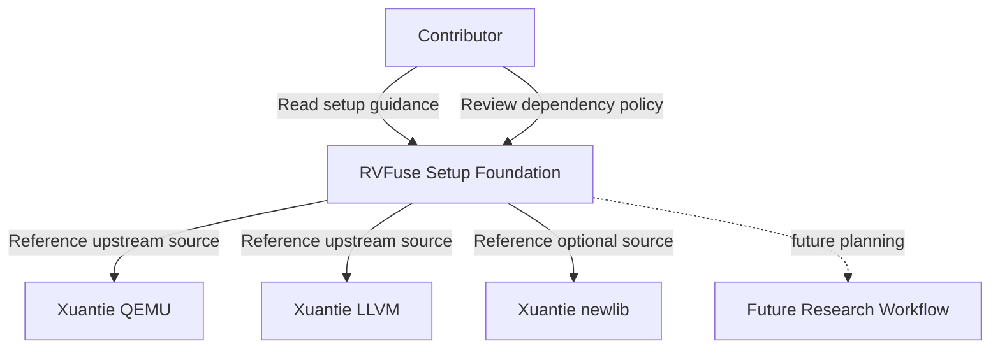
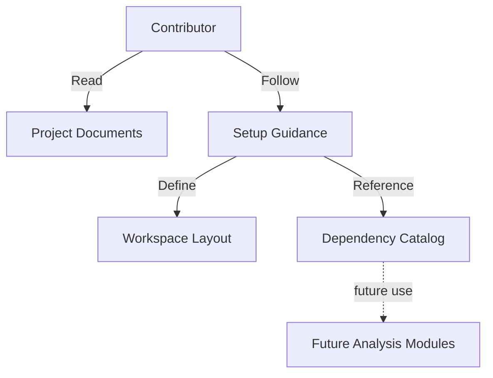
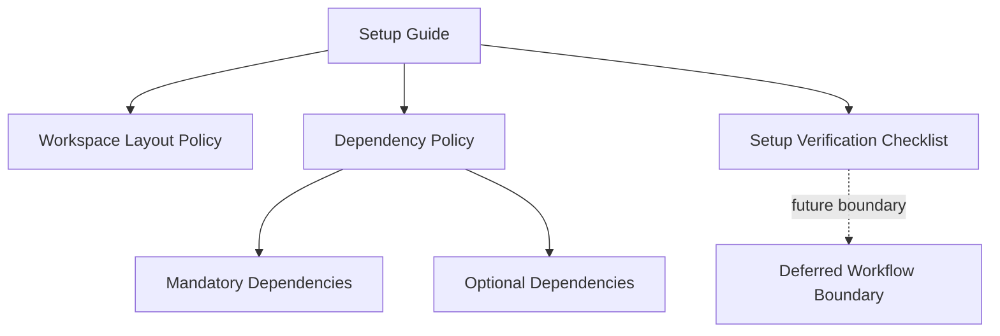

# Software Architecture Design: RVFuse

**Version**: 1.1 | **Date**: 2026-03-31 | **Status**: Draft

**Purpose**: This document describes the current architectural scope of RVFuse for the present phase, which is limited to repository structure, dependency access, and setup guidance. Research workflows such as hotspot analysis, DFG generation, and instruction-fusion validation remain future work.

---

## Table of Contents

1. Executive Summary
2. Architecture Snapshot
3. System Overview (C4)
4. Deployment Summary
5. Architecture Decisions (ADR Log)
6. Quality Attributes
7. Risks & Technical Debt
8. Agent Checklist

---

## 1. Executive Summary

- **What**: RVFuse is a RISC-V instruction fusion research project whose current phase establishes the project workspace, dependency references, and setup baseline.
- **Why**: A stable and well-documented setup foundation is required before any profiling, DFG, or fusion-validation work can be designed and implemented safely.
- **Current Scope**: Repository structure, dependency source references, optional dependency policy, setup guidance, and setup verification criteria.
- **Deferred Scope**: Hotspot detection, DFG generation, fusion candidate discovery, fused instruction implementation, and cycle comparison.

---

## 2. Architecture Snapshot

- **Business Goals**:
  1. Define a clear repository structure for the current phase
  2. Document mandatory and optional external dependencies without ambiguity
  3. Preserve canonical source references for future dependency acquisition
  4. Make contributor onboarding repeatable and auditable
  5. Reserve clean extension points for later research workflows

- **Constraints**:
  - Current phase is limited to project structure and dependency access
  - Development is local-first on Linux x86_64 hosts
  - External repositories are allowed for dependency acquisition and reference
  - Xuantie newlib is optional in the current phase and must remain documented
  - Any future workload example referenced in current documents must have a traceable source

- **Quality Targets**:
  - Setup guidance is understandable without relying on future workflow assumptions
  - Mandatory and optional dependency status is consistent across documents
  - Current-phase setup can be completed within 30 minutes, excluding network download time, first-time dependency synchronization time, and third-party build time
  - Current-phase documents do not require profiling, DFG, or fusion-validation capabilities to verify setup completion

- **Key Dependencies**:
  - Xuantie QEMU: https://github.com/XUANTIE-RV/qemu
  - Xuantie LLVM: https://github.com/XUANTIE-RV/llvm-project
  - Xuantie newlib: https://github.com/XUANTIE-RV/newlib

---

## 3. System Overview (C4)

### 3.1 Context



**Context Description**:
- **Contributor**: Developer or researcher preparing the workspace for the current phase
- **RVFuse Setup Foundation**: Repository structure, setup documentation, dependency policy, and verification criteria
- **Xuantie QEMU / LLVM**: External toolchain dependencies that are part of the current dependency baseline
- **Xuantie newlib**: Optional external dependency retained as a documented source for future scenarios
- **Future Research Workflow**: Later-phase profiling, DFG, and fusion-validation work that is intentionally outside the current delivery scope

### 3.2 Containers



**Container Description**:
| Container | Purpose |
|-----------|---------|
| Project Documents | Capture scope, architecture, and decisions for the current phase |
| Setup Guidance | Explain how contributors prepare and verify the current-phase workspace |
| Workspace Layout | Defines the repository areas expected in the setup phase |
| Dependency Catalog | Records mandatory and optional dependency references and their roles |
| Future Analysis Modules | Placeholder for later research capabilities that are not part of the current phase |

### 3.3 Components



**Component Responsibilities**:
| Component | Responsibility |
|-----------|---------------|
| Setup Guide | Describe the current-phase setup flow for contributors |
| Workspace Layout Policy | Define the repository structure expected in the current phase |
| Dependency Policy | Distinguish mandatory and optional dependencies and preserve source references |
| Setup Verification Checklist | Define how contributors confirm setup completion |
| Deferred Workflow Boundary | State what remains outside the current phase |

---

## 4. Deployment Summary

- **Runtime**: Local Linux workstation
- **Primary Audience**: Contributors preparing the repository for future RVFuse research work
- **Current Deliverables**: Project documents, dependency references, setup policy, and setup verification guidance
- **Dependency Access Model**: External toolchain repositories are tracked by reference and are intended to be integrated through the repository setup process

**Current-Phase Workspace Layout**:
```text
RVFuse/
├── docs/                   # Architecture and contributor-facing project documents
├── specs/                  # Feature specifications for scoped project work
├── memory/                 # Project governance and working memory artifacts
└── third_party/            # External dependency integration point for current and future phases
    ├── qemu/               # Xuantie QEMU
    ├── llvm-project/       # Xuantie LLVM
    └── newlib/             # Xuantie newlib (optional in current phase)
```

**Deferred Layout Areas**:
- `src/`, `tests/`, `builds/`, `results/`, and analysis-specific configuration assets are future-phase workspace areas and are not required for current-phase setup completion.

---

## 5. Architecture Decisions (ADR Log)

| ID | Title | Status | Date |
|----|-------|--------|------|
| ADR-001 | Use Git Submodules for External Toolchain Integration | Accepted | 2026-03-31 |
| ADR-002 | Deliver the Project in Stages | Accepted | 2026-03-31 |
| ADR-003 | Keep newlib Optional in the Current Phase | Accepted | 2026-03-31 |
| ADR-004 | Require Traceable Workload References | Accepted | 2026-03-31 |

### ADR-001: Use Git Submodules for External Toolchain Integration

**Context**: RVFuse depends on upstream toolchain repositories that must remain versionable and attributable.

**Decision**: Use `third_party/` as the integration point for external repositories and manage those integrations through Git submodule-based setup work.

**Consequences**:
- (+) Keeps upstream provenance explicit
- (+) Supports repeatable dependency synchronization
- (-) First-time dependency synchronization can be slow
- (-) Large upstream repositories increase local checkout cost

### ADR-002: Deliver the Project in Stages

**Context**: The end-state research platform is broader than the current setup work.

**Decision**: Limit the present phase to project structure and dependency access, and defer profiling, DFG, and fusion-validation design to later features.

**Consequences**:
- (+) Prevents current documents from overcommitting future implementation work
- (+) Makes setup validation simpler and more objective
- (-) Some future architecture details remain intentionally unspecified

### ADR-003: Keep newlib Optional in the Current Phase

**Context**: Not every current scenario requires bare-metal runtime support.

**Decision**: Treat Xuantie newlib as optional for the current phase while preserving its canonical source reference for later scenarios.

**Consequences**:
- (+) Avoids blocking current setup on an unnecessary dependency
- (+) Keeps future bare-metal expansion visible
- (-) Future features must explicitly state when newlib becomes mandatory

### ADR-004: Require Traceable Workload References

**Context**: Future validation examples must be attributable to real sources.

**Decision**: Any workload or benchmark mentioned in current-phase documents must have a traceable origin instead of being invented for convenience.

**Consequences**:
- (+) Improves credibility of future validation planning
- (+) Reduces ambiguity in later acceptance criteria
- (-) Workload examples cannot be added casually without source documentation

---

## 6. Quality Attributes

### 6.1 Setup Clarity

- **Targets**:
  - Contributors can distinguish setup work from deferred research work on first read
  - Current-phase setup verification does not depend on unfinished later-stage capabilities

- **Strategies**:
  - Keep current-phase and deferred-phase sections explicit
  - Use one dependency policy across spec and architecture documents
  - Define setup completion criteria in contributor-facing language

### 6.2 Reproducibility

- **Targets**:
  - Mandatory dependency status is consistent across planning documents
  - Optional dependencies include activation conditions
  - Dependency sources remain traceable

- **Strategies**:
  - Maintain one canonical dependency list
  - Keep optional dependency rules near the setup guidance
  - Preserve upstream repository references in architecture and setup documentation

### 6.3 Reliability

- **Targets**:
  - Contributors can recover from temporary dependency acquisition failures using documented fallback guidance
  - Current-phase setup can be validated without third-party compilation success

- **Strategies**:
  - Document retry and fallback expectations
  - Separate dependency acquisition from later build and execution workflows
  - Keep current acceptance focused on structure and access, not on deferred runtime behavior

### 6.4 Scope Control

- **Targets**:
  - Profiling, DFG, and fusion-validation requirements do not appear as current-phase deliverables
  - Deferred technical decisions remain visible without blocking the current phase

- **Strategies**:
  - Move future workflow capabilities into later features
  - Record only current-phase architectural decisions here
  - Flag future work explicitly rather than implying readiness

---

## 7. Risks & Technical Debt

| ID | Risk/Debt | Impact | Mitigation/Plan |
|----|-----------|--------|-----------------|
| R-001 | Upstream repository availability | High | Preserve canonical source links and document retry or manual fallback expectations |
| R-002 | Large dependency footprint | Medium | Keep setup timing separate from download and build costs |
| R-003 | Optional dependency confusion | Medium | Keep mandatory and optional status synchronized across documents |
| TD-001 | Profiling workflow remains unspecified | Low | Define it in a later feature after setup completion |
| TD-002 | DFG validity criteria remain unspecified | Low | Resolve in a future DFG-focused specification rather than in the setup phase |
| TD-003 | Benchmark selection policy is only partially defined | Low | Require traceable sources and formalize selection criteria in a future validation feature |

---

## 8. Agent Checklist

### Inputs
- Project scope confirmation for the current phase
- Repository structure expectations
- Mandatory dependency list
- Optional dependency list and activation conditions
- Canonical upstream source references

### Outputs
- Current-phase setup documentation
- Repository structure definition
- Dependency policy with mandatory and optional status
- Setup verification guidance
- Deferred-work boundary notes

### Acceptance Guardrails
- Do not treat hotspot analysis, DFG generation, or fusion validation as current-phase deliverables
- Do not mark Xuantie newlib as mandatory in the current phase
- Do not include download time, first-time dependency synchronization time, or third-party build time in the 30-minute setup target
- Do not reference benchmark or workload examples without a traceable source

---

**Notes**

- This document intentionally describes the current delivery phase rather than the full long-term research platform
- Future profiling, DFG, and fusion-validation architecture should be introduced through separate feature specifications and follow-up architecture revisions
