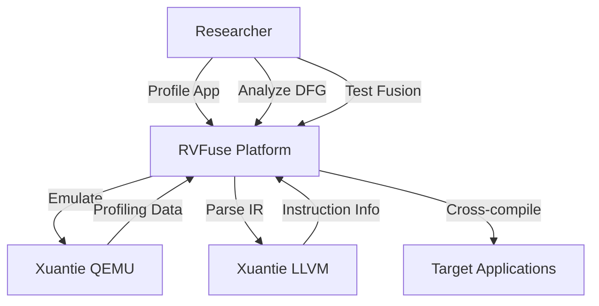
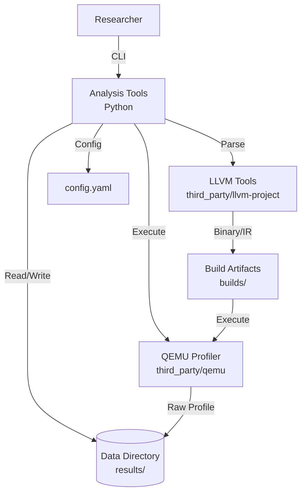
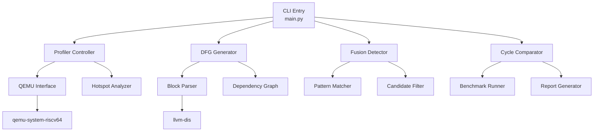

# Software Architecture Design: RVFuse

**Version**: 1.0 | **Date**: 2026-03-31 | **Status**: Draft

**Purpose**: This document captures the high-signal architectural data AI agents need to implement features correctly and safely for the RVFuse RISC-V instruction fusion research platform.

---

## Table of Contents

1. Executive Summary
2. Architecture Snapshot
3. System Overview (C4)
4. Deployment Summary
5. Architecture Decisions (ADR Log)
6. Quality Attributes (Targets & Strategies)
7. Risks & Technical Debt
8. Agent Checklist

---

## 1. Executive Summary

- **What**: RVFuse is a research platform for discovering and validating RISC-V instruction fusion candidates. It profiles applications via QEMU emulation, identifies hot functions and basic blocks, generates Data Flow Graphs (DFG), and tests potential fused instructions for cycle reduction.
- **Why**: Enable RISC-V architecture optimization research by providing automated tooling to identify, analyze, and validate instruction fusion opportunities that can improve processor performance.
- **Core Tech**: Python 3.11+ for analysis tools, Xuantie QEMU (emulation/profiling), Xuantie LLVM (instruction analysis), Git submodules for dependency management, JSON/Markdown for outputs.

---

## 2. Architecture Snapshot

- **Business Goals**:
  1. Automate hotspot detection in RISC-V applications
  2. Generate accurate DFG representations from basic blocks
  3. Identify fusion candidates with data dependency analysis
  4. Validate fusion effectiveness via cycle comparison
  5. Provide reproducible research workflow
  6. Enable extension to new applications and architectures

- **Constraints**:
  - Xuantie toolchain required (QEMU, LLVM, newlib from GitHub)
  - RISC-V target applications must be cross-compiled
  - Minimum 8GB RAM, 20GB disk for submodule builds
  - Linux development environment (x86_64 host)
  - Git submodule architecture for third-party code

- **Quality Targets**:
  - Performance: Profiling output within 10 min for standard apps; DFG generation <5 min per candidate
  - Availability: Research tooling, not production - 95% acceptable
  - Security: Local execution only, no external network calls
  - Maintainability: 80% test coverage for analysis tools

- **Key Dependencies**:
  - Xuantie QEMU: https://github.com/XUANTIE-RV/qemu
  - Xuantie LLVM: https://github.com/XUANTIE-RV/llvm-project
  - Xuantie newlib: https://github.com/XUANTIE-RV/newlib (optional)
  - ONNX Runtime (sample workload for profiling)

---

## 3. System Overview (C4)

### 3.1 Context



**Context Description**:
- **Researcher**: Primary user running profiling and analysis workflows
- **RVFuse Platform**: Core analysis and orchestration system
- **Xuantie QEMU**: RISC-V emulator with profiling capabilities
- **Xuantie LLVM**: Compiler infrastructure for instruction analysis
- **Target Applications**: RISC-V compiled workloads (ONNX Runtime, benchmarks)

### 3.2 Containers



**Container Description**:
| Container | Technology | Purpose |
|-----------|------------|---------|
| Analysis Tools | Python 3.11+ | Core analysis pipeline: profiling orchestration, DFG generation, fusion detection |
| QEMU Profiler | Xuantie QEMU (C) | RISC-V emulation with function/block timing instrumentation |
| LLVM Tools | Xuantie LLVM (C++) | Disassembly, IR analysis, instruction metadata extraction |
| Data Directory | JSON/Markdown files | Profiling results, DFG outputs, fusion reports |
| Build Artifacts | RISC-V binaries | Cross-compiled target applications for profiling |
| Config | YAML | Analysis parameters, threshold settings, paths |

### 3.3 Components (Key Interfaces)



**Component Responsibilities**:
| Component | Responsibility |
|-----------|---------------|
| CLI Entry | Command-line interface, workflow orchestration |
| Profiler Controller | Launch QEMU with profiling, collect timing data |
| Hotspot Analyzer | Rank functions/blocks by execution frequency |
| Block Parser | Extract instruction sequences from basic blocks |
| DFG Generator | Build data flow graph from instruction dependencies |
| Fusion Detector | Identify instruction sequences eligible for fusion |
| Pattern Matcher | Match known fusion patterns in instruction sequences |
| Cycle Comparator | Run benchmarks comparing original vs fused cycles |
| Report Generator | Output Markdown/JSON reports with results |

---

## 4. Deployment Summary

- **Runtime**: Linux workstation (x86_64 host), local execution
- **Environment**: Ubuntu 22.04+ or equivalent Linux distribution
- **Submodules**: Git submodules at `third_party/` (QEMU, LLVM, newlib)
- **Build Artifacts**: Compiled binaries stored in `builds/` directory
- **Results**: Analysis outputs in `results/` directory (JSON + Markdown)
- **CI/CD**: GitHub Actions for submodule integrity checks, Python linting, basic tests

**Directory Structure**:
```
RVFuse/
├── src/                    # Python analysis tools
│   ├── profiler/           # QEMU profiling interface
│   ├── dfg/                # DFG generation module
│   ├── fusion/             # Fusion detection module
│   └── report/             # Report generation
├── tests/                  # Test suite
│   ├── unit/
│   ├── integration/
│   └── contract/
├── third_party/            # Git submodules
│   ├── qemu/               # Xuantie QEMU
│   ├── llvm-project/       # Xuantie LLVM
│   └── newlib/             # Xuantie newlib (optional)
├── builds/                 # Compiled target applications
├── results/                # Analysis outputs
│   ├── profiles/
│   ├── dfg/
│   └── reports/
├── configs/                # Configuration files
├── docs/                   # Documentation
└── specs/                  # Feature specifications
```

---

## 5. Architecture Decisions (ADR Log)

| ID | Title | Status | Date |
| ---- | ------- |--------|------|
| ADR-001 | Git Submodules for Toolchain | Accepted | 2026-03-31 |
| ADR-002 | Python Analysis Pipeline | Accepted | 2026-03-31 |
| ADR-003 | JSON + Markdown Output Format | Accepted | 2026-03-31 |
| ADR-004 | Modular Pipeline Architecture | Accepted | 2026-03-31 |
| ADR-005 | Local Execution Only | Accepted | 2026-03-31 |

### ADR-001: Git Submodules for Toolchain

**Context**: Need to integrate Xuantie QEMU, LLVM, and newlib which are actively developed on GitHub.

**Decision**: Use git submodules at `third_party/` directory instead of vendoring or package managers.

**Consequences**:
- (+) Explicit version tracking via submodule commits
- (+) Easy updates via `git submodule update`
- (-) Initial clone requires submodule initialization
- (-) Large repository size after submodule clone

### ADR-002: Python Analysis Pipeline

**Context**: Analysis tools need to process profiling data, generate DFGs, and identify fusion patterns.

**Decision**: Python 3.11+ for all analysis code; leverage existing libraries for graph processing and data analysis.

**Consequences**:
- (+) Rich ecosystem for data processing (networkx for graphs, pandas for data)
- (+) Quick prototyping and iteration
- (+) Good CLI support via argparse/click
- (-) Performance limitations for very large datasets
- (-) Requires Python environment setup

### ADR-003: JSON + Markdown Output Format

**Context**: Analysis results need to be both machine-parseable and human-readable.

**Decision**: Use JSON for structured data (profiles, DFGs), Markdown for reports.

**Consequences**:
- (+) JSON enables downstream processing and visualization
- (+) Markdown provides readable reports for researchers
- (+) Both formats widely supported
- (-) Need to maintain format consistency between JSON and Markdown

### ADR-004: Modular Pipeline Architecture

**Context**: Analysis workflow has distinct phases: profiling → hotspot → DFG → fusion → testing.

**Decision**: Design as modular pipeline where each phase is an independent module with clear interfaces.

**Consequences**:
- (+) Each module testable independently
- (+) Easy to swap implementations (e.g., different DFG algorithms)
- (+) Pipeline can run partially (stop at any phase)
- (-) More initial design effort
- (-) Need to define clear data contracts between modules

### ADR-005: Local Execution Only

**Context**: This is a research tool for local workstation use.

**Decision**: No cloud deployment, no external API calls, all execution local.

**Consequences**:
- (+) Simple deployment, no infrastructure costs
- (+) No security concerns for external access
- (+) Full control over execution environment
- (-) Cannot scale to distributed analysis
- (-) Each researcher needs full setup

---

## 6. Quality Attributes (Targets & Strategies)

### 6.1 Performance

- **Targets**:
  - Profiling workflow: <10 min for standard test application
  - DFG generation: <5 min per hot basic block
  - Cycle comparison: <5 min per fusion candidate

- **Strategies**:
  - Cache QEMU profiling results to avoid re-running
  - Use efficient graph algorithms for DFG (networkx with optimized traversal)
  - Parallelize candidate analysis where possible
  - Limit hotspot analysis to top N functions/blocks

### 6.2 Scalability

- **Targets**:
  - Support applications with 10k+ functions
  - Handle basic blocks with 100+ instructions
  - Process 50+ fusion candidates per run

- **Strategies**:
  - Streaming processing for large profiling outputs
  - Memory-efficient DFG representation
  - Thresholds to filter low-impact candidates
  - Configurable analysis depth

### 6.3 Availability & Reliability

- **Targets**: 95% successful analysis runs (research tool, not production)

- **Strategies**:
  - Graceful handling of QEMU crashes
  - Fallback paths when profiling fails
  - Validation of input data before processing
  - Clear error messages with actionable guidance

### 6.4 Security

- **Baseline**: Local execution, no network calls
- **Practices**:
  - No credential storage required
  - Sandboxed QEMU execution
  - Input validation for configuration files
  - No PII or sensitive data in outputs

### 6.5 Maintainability & Observability

- **Tests**:
  - Unit tests for all modules (target 80% coverage)
  - Integration tests for pipeline phases
  - Contract tests for data format validity

- **Telemetry**:
  - Structured logging (JSON format) to `logs/` directory
  - Progress indicators for long-running operations
  - Debug mode for verbose pipeline tracing
  - Output artifacts for reproducibility

---

## 7. Risks & Technical Debt

| ID | Risk/Debt | Impact | Mitigation/Plan |
| ---- | ----------- |--------|-----------------|
| R-001 | Xuantie repo availability | High | Document manual download procedure; pin to specific commits |
| R-002 | QEMU build complexity | Medium | Provide detailed build guide; containerized build option |
| R-003 | LLVM IR parsing changes | Medium | Version-specific parsers; abstraction layer for LLVM interface |
| R-004 | Large submodule size | Medium | Shallow clone option for quick setup |
| TD-001 | No visualization tooling | Low | Future: add web-based DFG visualization |
| TD-002 | Manual fusion implementation | Low | Future: automated fused instruction template generation |

---

## 8. Agent Checklist

### Inputs
- **Application Binary**: RISC-V ELF executable at `builds/<app>/`
- **Configuration**: YAML file at `configs/analysis.yaml`
- **Thresholds**: Hotspot cutoff (cycles/frequency), DFG complexity limit

### Outputs
- **Profile Data**: JSON at `results/profiles/<app>_profile.json`
- **Hotspot Report**: JSON at `results/profiles/<app>_hotspots.json`
- **DFG Files**: JSON at `results/dfg/<block_id>_dfg.json`
- **Fusion Report**: Markdown at `results/reports/<app>_fusion_report.md`

### Data Contracts
```json
// Profile Data Schema
{
  "app_name": "string",
  "total_cycles": "integer",
  "functions": [
    {
      "name": "string",
      "address": "hex_string",
      "cycles": "integer",
      "blocks": [
        {
          "id": "string",
          "address": "hex_string",
          "cycles": "integer",
          "instruction_count": "integer"
        }
      ]
    }
  ]
}

// DFG Schema
{
  "block_id": "string",
  "instructions": [
    {
      "id": "string",
      "opcode": "string",
      "operands": ["string"],
      "type": "load|store|compute|branch"
    }
  ],
  "edges": [
    {
      "from": "instruction_id",
      "to": "instruction_id",
      "dependency": "data|control"
    }
  ]
}
```

### SLOs
- Profiling: 95% success rate, <10 min runtime
- DFG: 95% valid graphs, <5 min per block
- Reports: Human-readable, actionable recommendations

### Config
```yaml
# configs/analysis.yaml structure
analysis:
  hotspot_threshold: 1000  # minimum cycles to consider
  top_functions: 20        # number of top functions to analyze
  top_blocks_per_function: 5
  fusion_patterns:
    - pattern: "load-compute"
      min_dependency_depth: 2
    - pattern: "compute-compute"
      min_dependency_depth: 3
```

### Failure Modes
- **QEMU crash**: Retry with reduced profiling scope, log error
- **Invalid binary**: Validate ELF format before profiling
- **Empty profile**: Report "no candidates found" with summary
- **Build failure**: Provide manual build guide link

### Module Interfaces
| Module | Input | Output | Interface |
|--------|-------|--------|-----------|
| Profiler Controller | Binary path, config | Profile JSON | `profiler.run(binary, config)` |
| Hotspot Analyzer | Profile JSON | Hotspot JSON | `analyzer.analyze(profile, thresholds)` |
| Block Parser | Block data | Instruction list | `parser.parse(block)` |
| DFG Generator | Instruction list | DFG JSON | `dfg.generate(instructions)` |
| Fusion Detector | DFG JSON | Candidates JSON | `fusion.detect(dfg, patterns)` |
| Cycle Comparator | Original binary, fused instruction | Comparison JSON | `compare.run(original, fused)` |

---

**Notes**

- All diagrams use Mermaid format for rendering in markdown viewers
- Values are concrete (paths, thresholds, formats) for agent implementation
- Ground-rules principles (Code Quality, Testing, UX, Performance) apply to all Python code
- Submodule URLs verified at specification creation time