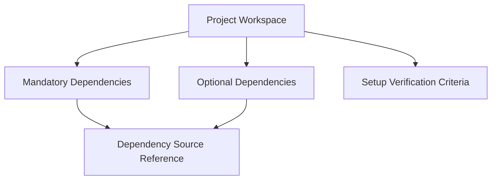

# Design: Project Setup Foundation + Docker LLVM Toolchain

**Date**: 2026-03-31 ~ 2026-04-01 | **Status**: Completed

This document consolidates the research, design decisions, and interface contracts from the initial project setup phase (features 001 and 002).

---

## 1. Setup Foundation Research

### 1.1 Dependency Source Verification

All upstream repositories verified as public and accessible:

| Repository | URL | Status |
|------------|-----|--------|
| Xuantie QEMU | https://github.com/XUANTIE-RV/qemu | Verified |
| Xuantie LLVM | https://github.com/XUANTIE-RV/llvm-project | Verified |
| Xuantie newlib | https://github.com/XUANTIE-RV/newlib | Verified (optional) |

**Decision**: Use GitHub links directly as canonical source references (ADR-001).

**Alternatives rejected**: Mirror repos (lose attribution), package managers (not available), vendored copies (lose version tracking).

### 1.2 Git Submodule Best Practices

- Document initialization in setup guide
- Provide shallow clone option (`--depth 1`) for large repos
- Pin to specific commits rather than tracking HEAD
- Document fallback for network failures

### 1.3 Optional Dependency Policy

Xuantie newlib documented with explicit optional status:

| Field | Value |
|-------|-------|
| Status | Optional in current phase |
| Activation condition | Required when bare-metal runtime support needed |
| Impact | Setup completable without newlib |
| Source | Preserved canonical URL |

### 1.4 Data Model: Project Workspace

**Mandatory Dependencies**:

| name | source_url | integration_path |
|------|------------|------------------|
| Xuantie QEMU | https://github.com/XUANTIE-RV/qemu | third_party/qemu |
| Xuantie LLVM | https://github.com/XUANTIE-RV/llvm-project | third_party/llvm-project |

**Optional Dependencies**:

| name | source_url | integration_path | activation_condition |
|------|------------|------------------|---------------------|
| Xuantie newlib | https://github.com/XUANTIE-RV/newlib | third_party/newlib | Required when bare-metal runtime support needed |

---

## 2. Docker LLVM Toolchain Research

### 2.1 LLVM Docker Image Strategy

**Decision**: Use `apt.llvm.org` packages for LLVM 13 in a Debian-based container.

**Rationale**:
- Official LLVM binaries, reproducible builds
- Avoids lengthy source compilation
- apt.llvm.org provides packages for multiple Debian/Ubuntu versions

**Alternatives rejected**:
- Building LLVM from source in Dockerfile: too slow, large image
- Espressif IDF: too specific to ESP32
- SiFive toolchain: good alternative, different patches

### 2.2 RISC-V Cross-Compilation Configuration

| Setting | Value |
|---------|-------|
| LLVM version | 13.0.0 (matches submodule) |
| Target triple | `riscv64-unknown-elf` (bare-metal compatible) |
| Required tools | clang, lld, llvm-objdump, llvm-objcopy, llvm-strip |

**Note**: Docker toolchain uses upstream LLVM 13, which may differ slightly from Xuantie LLVM (custom patches). Differences should be documented, not hidden.

### 2.3 Wrapper Script Best Practices

- Volume mounting: `-v "$PWD:/work"`
- User mapping: `--user $(id -u):$(id -g)`
- Cleanup: `--rm` to remove container after execution
- Error handling: Capture exit codes from container
- Shared `common.sh` for image management

---

## 3. Script Interface Contracts

### 3.1 Wrapper Scripts

| Script | Tool | Purpose |
|--------|------|---------|
| `riscv-clang` | clang | C compiler for RISC-V |
| `riscv-clang++` | clang++ | C++ compiler for RISC-V |
| `riscv-ld` | ld.lld | Linker for RISC-V objects |
| `riscv-objdump` | llvm-objdump | Disassembler and object inspector |
| `riscv-strip` | llvm-strip | Symbol stripper |
| `riscv-readelf` | llvm-readelf | ELF inspector |

### 3.2 Standard Arguments (all wrappers)

| Argument | Description | Example |
|----------|-------------|---------|
| `--version` | Print tool version | `riscv-clang --version` |
| `--help` | Print usage information | `riscv-clang --help` |
| `--docker-opts` | Additional Docker options | `riscv-clang --docker-opts="-e VAR=val" file.c` |
| `--image` | Override default image | `riscv-clang --image=custom/llvm:14 file.c` |

### 3.3 Exit Codes

| Code | Meaning |
|------|---------|
| 0 | Success |
| 1 | Compilation/tool error |
| 2 | Docker not available |
| 3 | Image pull failure |
| 4 | Invalid arguments |

### 3.4 Environment Variables

| Variable | Description | Default |
|----------|-------------|---------|
| `RVFUSE_LLVM_IMAGE` | Override default Docker image | `rvfuse/llvm-riscv:13` |
| `RVFUSE_LLVM_TARGET` | Override default target triple | `riscv64-unknown-elf` |
| `RVFUSE_LLVM_DOCKER_OPTS` | Additional Docker options | (empty) |

### 3.5 Error Messages

| Condition | Message |
|-----------|---------|
| Docker not installed | `Error: Docker is not installed. Please install Docker first.` |
| Docker daemon not running | `Error: Cannot connect to Docker daemon. Is Docker running?` |
| Permission denied | `Error: Permission denied. Add user to docker group: sudo usermod -aG docker $USER` |
| Image not found | `Error: Image not found. Pull with: docker pull rvfuse/llvm-riscv:13` |

---

## 4. ADR References

| ADR | Decision | Date |
|-----|----------|------|
| ADR-001 | Git submodules for external toolchain | 2026-03-31 |
| ADR-002 | Deliver in stages | 2026-03-31 |
| ADR-003 | newlib optional | 2026-03-31 |
| ADR-004 | Traceable workload references | 2026-03-31 |
