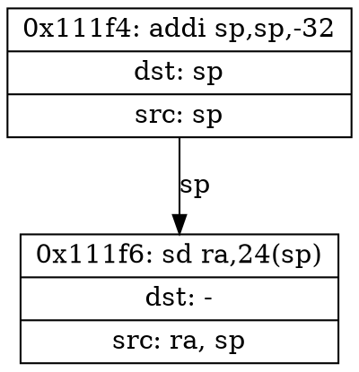

# DFG Generation Module Design

**Date**: 2026-04-05
**Status**: Approved

## Overview

Develop a Python module that parses basic blocks (BBs) from QEMU BBV `.disas` files and generates a Data Flow Graph (DFG) for each BB, where each node is a RISC-V instruction and edges represent RAW (Read-After-Write) data dependencies. Includes an AI agent fallback via Claude Code CLI for verification and generation of unsupported instructions.

## Decisions

| Decision | Choice | Rationale |
|----------|--------|-----------|
| Input source | `.disas` text | Directly parse QEMU plugin output; seamless integration |
| Output format | DOT + JSON | Visualization (DOT) and programmatic processing (JSON) |
| Dependency management | uv with third-party deps | Flexibility for libraries like graphviz |
| ISA scope | RV64GCV, selectable and extensible | Full coverage needed; plug-in architecture for gradual implementation |
| Parsing approach | Regex + hand-written decoder | Lightweight, matches existing codebase style, register mapping is a lookup problem |
| Agent invocation | Claude Code CLI subprocess | Leverages existing tooling, no additional API key management |
| Agent batching | Per-BB (one call per BB) | Accuracy over speed; each BB checked independently |

## Architecture

### File Structure

```
tools/
├── dfg/
│   ├── __init__.py
│   ├── __main__.py               # CLI entry: python -m tools.dfg
│   ├── parser.py                 # .disas text file parser
│   ├── instruction.py            # Instruction definitions, register extraction, ISA registry
│   ├── dfg.py                    # DFG construction (nodes=instructions, edges=RAW dependencies)
│   ├── output.py                 # DOT + JSON output formatting
│   ├── agent.py                  # Agent dispatcher: check / fallback generation
│   ├── isadesc/                  # ISA extension descriptions (pluggable)
│   │   ├── __init__.py
│   │   ├── rv64i.py              # RV64I: base integer
│   │   ├── rv64m.py              # M: multiply/divide
│   │   ├── rv64f.py              # F: single-precision float
│   │   ├── rv64d.py              # D: double-precision float
│   │   ├── rv64a.py              # A: atomic
│   │   ├── rv64c.py              # C: compressed
│   │   └── rv64v.py              # V: vector
│   └── tests/
│       ├── test_parser.py
│       ├── test_instruction.py
│       ├── test_dfg.py
│       ├── test_output.py
│       └── test_agent.py
└── pyproject.toml                # uv project configuration
```

### Module Responsibilities

| Module | Responsibility |
|--------|---------------|
| `parser.py` | Read `.disas` text, parse into `BasicBlock` list (address, instruction sequence) |
| `instruction.py` | `Instruction` dataclass + `ISARegistry`: lookup mnemonic to get dst/src register patterns |
| `dfg.py` | Iterate BB instructions, build RAW dependency edges using `last_writer` map |
| `output.py` | Serialize DFG to DOT (Graphviz) and JSON formats |
| `agent.py` | Dispatch BB to Claude Code CLI for check or generate; parse structured response |
| `isadesc/` | Each file registers instruction register-extraction rules for one extension |

## Data Model

```python
@dataclass
class Instruction:
    address: int          # Virtual address
    mnemonic: str         # Mnemonic (e.g., "addi")
    operands: str         # Raw operand string (e.g., "sp,sp,-32")
    raw_line: str         # Original line text

@dataclass
class RegisterFlow:
    dst_regs: list[str]   # Written registers (e.g., ["rd"] -> instantiated as ["sp"])
    src_regs: list[str]   # Read registers (e.g., ["rs1", "rs2"] -> instantiated as ["a0", "a1"])

@dataclass
class BasicBlock:
    bb_id: int
    vaddr: int
    instructions: list[Instruction]

@dataclass
class DFGNode:
    instruction: Instruction
    index: int                # Index within the BB

@dataclass
class DFGEdge:
    src_index: int            # Data producer (instruction that wrote register)
    dst_index: int            # Data consumer (instruction that read register)
    register: str             # Register name for the dependency

@dataclass
class DFG:
    bb: BasicBlock
    nodes: list[DFGNode]
    edges: list[DFGEdge]
    source: str               # "script" | "agent"
```

### DFG Construction Algorithm

Iterate BB instructions in order, maintain `last_writer: dict[reg, insn_index]`. For each instruction, look up its `src_regs` in `last_writer` to create RAW edges. After processing, update `last_writer` with the instruction's `dst_regs`.

## ISA Registry

```python
class ISARegistry:
    def get_flow(self, mnemonic: str) -> RegisterFlow | None:
        """Returns (dst_regs, src_regs) for a given mnemonic.
        e.g., add -> (["rd"], ["rs1", "rs2"])"""
```

Each `isadesc/rv64*.py` file defines register-extraction rules for its extension. Loaded into the registry at startup. User selects enabled extensions via `--isa I,M,F` CLI flag. Default: `I` only.

## Agent Integration

### Dispatch Flow

```
For each BB:
  1. parser parses .disas text -> BasicBlock
  2. Check if all instructions are in registered ISA
     ├── All supported -> instruction + dfg generate DFG JSON
     │                  -> invoke Agent (check skill) to verify DFG
     │                  ├── Agent returns pass -> accept result
     │                  └── Agent returns fail -> log issues, keep script result
     └── Unsupported instruction found -> invoke Agent (generate skill)
                                       -> accept agent result directly
  3. output writes final DOT + JSON
```

### Agent Dispatcher (agent.py)

```python
class AgentDispatcher:
    def __init__(self, enabled: bool = True):
        self.enabled = enabled

    def check(self, bb: BasicBlock, dfg: DFG) -> CheckResult:
        """Send BB disassembly + DFG JSON to agent for verification"""
        # Invoke: claude --print "use dfg-check skill to verify..."
        # Parse JSON response: {verdict, issues?}

    def generate(self, bb: BasicBlock) -> DFG | None:
        """Send unsupported BB to agent for DFG generation"""
        # Invoke: claude --print "use dfg-generate skill to generate..."
        # Parse DFG JSON response

    def _invoke_claude(self, prompt: str) -> str:
        """Subprocess call to Claude Code CLI"""
```

### Agent Skills

**dfg-check**: Verify DFG correctness
- Input: BB disassembly text + DFG JSON
- Verify: RAW edges correct, no missing/extra dependencies, pseudo-instructions handled
- Output: `{verdict: "pass" | "fail", issues: [{type, description, suggestion?}]}`

**dfg-generate**: Generate DFG for unsupported instructions
- Input: BB disassembly text
- Generate: Identify src/dst registers for all instructions (including unregistered extensions), build DFG per RAW rules
- Output: DFG JSON matching the standard data model

## Output Format

### DOT (per BB)



### JSON (per BB)

```json
{
  "bb_id": 1,
  "vaddr": "0x111f4",
  "source": "script",
  "nodes": [
    {"index": 0, "address": "0x111f4", "mnemonic": "addi", "operands": "sp,sp,-32"}
  ],
  "edges": [
    {"src": 0, "dst": 1, "register": "sp"}
  ]
}
```

### summary.json

```json
{
  "input_file": "output/yolo.bbv.disas",
  "total_bbs": 16,
  "script_generated": 14,
  "agent_generated": 2,
  "agent_checked_pass": 13,
  "agent_checked_fail": 1,
  "isa_extensions_used": ["I"],
  "unsupported_instructions": ["vadd.vv", "vsetvli"]
}
```

### CLI Interface

```bash
python -m tools.dfg --disas <file.disas> [options]

Options:
  --disas FILE        .disas input file (required)
  --output-dir DIR    Output directory (default: dfg/ next to input file)
  --isa EXTENSIONS    Enabled ISA extensions, comma-separated (default: I)
  --no-agent          Disable agent check/fallback
  --bb-filter ID      Only process specified BB ID (for debugging)
  --verbose           Verbose logging
```

## Error Handling

| Scenario | Handling |
|----------|----------|
| `.disas` format error | Parser reports error, skips BB, records in summary |
| Mnemonic not in registry | Marked as unsupported, triggers agent generate |
| Agent CLI unavailable | Skip agent, continue in script-only mode |
| Agent returns unparseable JSON | Log warning, mark BB as `source: failed`, don't block other BBs |
| Agent check returns fail | Log issues to summary, keep script result (script has priority, agent is advisory) |

## Testing Strategy

| Layer | Content | Tool |
|-------|---------|------|
| `test_parser.py` | Various `.disas` formats, empty lines, malformed lines | pytest + .disas fixtures |
| `test_instruction.py` | src/dst register extraction for each registered instruction | pytest, per-instruction assertions |
| `test_dfg.py` | RAW edge construction, no-dependency instructions, pseudo-instructions | pytest, small BB fixtures |
| `test_output.py` | DOT/JSON serialization correctness | pytest + structural validation |
| `test_agent.py` | Agent dispatcher with mocked subprocess | pytest + subprocess mock |

Each `isadesc/rv64*.py` includes `TEST_VECTORS: [(mnemonic, operands, expected_dst, expected_src), ...]` as self-test data for the extension.
