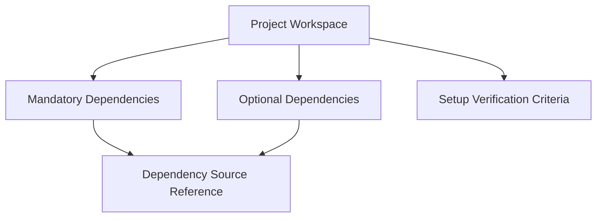

# Data Model: RVFuse Project Setup Foundation

**Date**: 2026-03-31 | **Phase**: 1

## Entity Definitions

This feature defines documentation entities only - no database or runtime data structures.

### 1. Project Workspace

**Purpose**: Repository structure defining the setup baseline

| Field | Type | Description |
|-------|------|-------------|
| name | string | "RVFuse" |
| phase | string | "setup" (current), "profiling" (future), "dfg" (future), "validation" (future) |
| areas | list[string] | Current: ["docs", "specs", "memory", "third_party", ".rainbow"] |
| deferred_areas | list[string] | Future: ["src", "tests", "builds", "results", "configs"] |

**Validation Rules**:
- Current phase areas MUST exist in repository
- Deferred areas MUST NOT be created in current phase
- Area purposes MUST be documented

---

### 2. Mandatory Dependency

**Purpose**: External dependency required for current setup phase

| Field | Type | Description |
|-------|------|-------------|
| name | string | Dependency identifier |
| source_url | string | Canonical upstream repository URL |
| integration_path | string | Local path in `third_party/` |
| submodule_status | boolean | True if integrated as git submodule |

**Instances (Current Phase)**:

| name | source_url | integration_path |
|------|------------|------------------|
| Xuantie QEMU | https://github.com/XUANTIE-RV/qemu | third_party/qemu |
| Xuantie LLVM | https://github.com/XUANTIE-RV/llvm-project | third_party/llvm-project |

**Validation Rules**:
- source_url MUST be valid GitHub URL
- integration_path MUST be under `third_party/`
- Status MUST be documented as "mandatory"

---

### 3. Optional Dependency

**Purpose**: External dependency preserved for future use, not required in current phase

| Field | Type | Description |
|-------|------|-------------|
| name | string | Dependency identifier |
| source_url | string | Canonical upstream repository URL |
| integration_path | string | Local path in `third_party/` |
| activation_condition | string | When this dependency becomes required |
| current_phase_status | string | "optional" |

**Instances (Current Phase)**:

| name | source_url | integration_path | activation_condition |
|------|------------|------------------|---------------------|
| Xuantie newlib | https://github.com/XUANTIE-RV/newlib | third_party/newlib | "Required when bare-metal runtime support needed" |

**Validation Rules**:
- activation_condition MUST be documented
- current_phase_status MUST be "optional"
- source_url MUST be preserved even if not integrated

---

### 4. Dependency Source Reference

**Purpose**: Canonical upstream location for dependency attribution

| Field | Type | Description |
|-------|------|-------------|
| dependency_name | string | Links to Mandatory/Optional Dependency |
| url | string | GitHub repository URL |
| owner | string | Repository owner (e.g., "XUANTIE-RV") |
| repo | string | Repository name |
| access_type | string | "public" (no authentication required) |

**Validation Rules**:
- URL MUST be traceable (per ADR-004)
- Owner/repo MUST match GitHub structure
- access_type MUST be documented

---

### 5. Setup Verification Criteria

**Purpose**: Checklist items confirming setup phase completion

| Field | Type | Description |
|-------|------|-------------|
| id | string | Criterion identifier (e.g., "VC-001") |
| description | string | What to verify |
| verification_method | string | How to verify (e.g., "directory exists", "file readable") |
| dependency_required | boolean | False if no dependency needed for verification |

**Instances**:

| id | description | verification_method | dependency_required |
|----|-------------|--------------------|--------------------|
| VC-001 | Repository structure matches specification | Directory check | false |
| VC-002 | Architecture document is readable | File readable | false |
| VC-003 | Setup guide is readable | File readable | false |
| VC-004 | Ground-rules are documented | File readable | false |
| VC-005 | Mandatory dependencies documented | Content check | false |
| VC-006 | Optional dependencies documented | Content check | false |
| VC-007 | Dependency sources traceable | URL validation | false |

**Validation Rules**:
- All criteria MUST be achievable without profiling/DFG/fusion capabilities
- dependency_required MUST be false for documentation-only criteria

---

## Relationships

---

## State Transitions

No state transitions in current phase - entities are static documentation artifacts.

Future phases may introduce:
- Dependency status: optional → mandatory (when activation condition met)
- Workspace phase: setup → profiling → dfg → validation