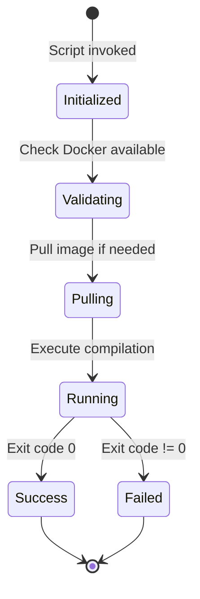
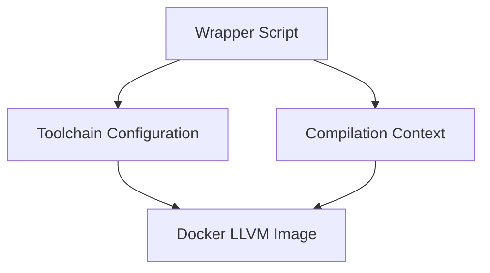

# Data Model: Docker LLVM RISC-V Toolchain

**Date**: 2026-04-01 | **Phase**: 1

## Entity Definitions

### 1. Docker LLVM Image

**Purpose**: Container image containing LLVM RISC-V toolchain

| Field | Type | Description |
|-------|------|-------------|
| name | string | Image identifier (e.g., `rvfuse/llvm-riscv`) |
| tag | string | Version tag (e.g., `13`, `13.0.0`) |
| full_name | string | Complete image reference (e.g., `rvfuse/llvm-riscv:13`) |
| llvm_version | string | LLVM version string (e.g., `13.0.0`) |
| target_triple | string | Default RISC-V target (e.g., `riscv64-unknown-elf`) |
| source | string | Image source (Docker Hub, ghcr.io, or local build) |
| size_mb | integer | Approximate image size in megabytes |

**Validation Rules**:
- name MUST be valid Docker image name format
- tag MUST be valid Docker tag format
- llvm_version SHOULD match submodule LLVM version (13.0.0-based)
- source MUST be traceable (per ADR-004)

**Default Instance**:

| name | tag | llvm_version | target_triple | source |
|------|-----|--------------|---------------|--------|
| rvfuse/llvm-riscv | 13 | 13.0.0 | riscv64-unknown-elf | Docker Hub |

---

### 2. Wrapper Script

**Purpose**: Shell script providing user-friendly interface to containerized toolchain

| Field | Type | Description |
|-------|------|-------------|
| name | string | Script filename (e.g., `riscv-clang`) |
| tool | string | LLVM tool it wraps (e.g., `clang`, `lld`, `llvm-objdump`) |
| image_ref | string | Docker image to use (references Docker LLVM Image) |
| mount_point | string | Container mount point for host filesystem |
| interactive | boolean | Whether to run in interactive mode |

**Validation Rules**:
- name MUST be valid filename (no spaces, special chars)
- tool MUST be a valid LLVM tool name
- mount_point MUST be absolute path inside container

**Instances**:

| name | tool | interactive |
|------|------|-------------|
| riscv-clang | clang | false |
| riscv-clang++ | clang++ | false |
| riscv-ld | ld.lld | false |
| riscv-objdump | llvm-objdump | false |
| riscv-strip | llvm-strip | false |

---

### 3. Toolchain Configuration

**Purpose**: Configuration settings for the Docker toolchain

| Field | Type | Description |
|-------|------|-------------|
| image_name | string | Default Docker image name |
| image_tag | string | Default image tag |
| docker_opts | list[string] | Additional Docker run options |
| target_triple | string | Default compilation target |
| sysroot | string | Optional sysroot path for headers/libraries |

**Validation Rules**:
- image_name MUST match an available Docker image
- target_triple MUST be valid LLVM target triple
- sysroot path MUST exist if specified

**Default Configuration**:

| Field | Value |
|-------|-------|
| image_name | rvfuse/llvm-riscv |
| image_tag | 13 |
| docker_opts | `["--rm", "-v", "$PWD:/work", "-w", "/work"]` |
| target_triple | riscv64-unknown-elf |
| sysroot | (none) |

---

### 4. Compilation Context

**Purpose**: Runtime context for a single compilation invocation

| Field | Type | Description |
|-------|------|-------------|
| working_dir | string | Host directory containing source files |
| source_files | list[string] | Source file paths relative to working_dir |
| output_file | string | Output binary path |
| compiler_flags | list[string] | Additional flags passed to compiler |
| target_flags | list[string] | Target-specific flags (e.g., `-march=rv64gc`) |

**Validation Rules**:
- working_dir MUST exist on host
- source_files MUST exist relative to working_dir
- output_file path MUST be writable

**State Transitions**:

---

## Relationships

---

## Script Interface Contract

### Standard Arguments

All wrapper scripts MUST accept:

| Argument | Description | Example |
|----------|-------------|---------|
| `--version` | Print tool version | `riscv-clang --version` |
| `--help` | Print usage information | `riscv-clang --help` |
| `--docker-opts` | Pass additional Docker options | `riscv-clang --docker-opts="-e VAR=val" file.c` |
| `--image` | Override default image | `riscv-clang --image=custom/llvm:14 file.c` |

### Exit Codes

| Code | Meaning |
|------|---------|
| 0 | Success |
| 1 | Compilation error |
| 2 | Docker not available |
| 3 | Image pull failure |
| 4 | Invalid arguments |
| 5 | Permission error |

### Environment Variables

| Variable | Description | Default |
|----------|-------------|---------|
| `RVFUSE_LLVM_IMAGE` | Override default image | `rvfuse/llvm-riscv:13` |
| `RVFUSE_LLVM_TARGET` | Override default target | `riscv64-unknown-elf` |
| `RVFUSE_LLVM_DOCKER_OPTS` | Additional Docker options | (empty) |