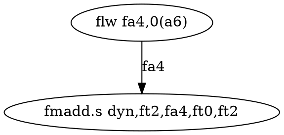

# DFG — RISC-V Data Flow Graph Generator

Generates Data Flow Graphs (DFG) from RISC-V basic blocks extracted via QEMU BBV profiling. Identifies register-level data dependencies within hot code paths for instruction fusion research.

## How It Works

```
QEMU BBV profiling (.disas)          Hotspot report (.json)
        |                                     |
        v                                     v
   parser.py ──> BasicBlock[] ──> filter.py ──> select hot BBs
                                         |
                                         v
                                    ISARegistry (I/F/M)
                                         |
                                         v
                                     dfg.py ──> DFG (nodes + edges)
                                         |
                                         v
                               output.py ──> DOT / JSON / PNG
```

1. **Parse** — Reads QEMU `.disas` files (basic blocks with RISC-V disassembly)
2. **Filter** — Selects hot basic blocks via coverage threshold or top-N ranking
3. **Build** — Constructs RAW (read-after-write) dependency edges using ISA register flow rules
4. **Output** — Writes Graphviz DOT, JSON, and optional PNG files

## Quick Start

```bash
# From the project root
cd tools && python3 -m dfg \
  --disas output/yolo.bbv.disas \
  --isa I,F,M \
  --report output/hotspot.json \
  --coverage 80 \
  --output-dir output/dfg \
  --no-agent
```

For a single basic block (debugging):

```bash
python3 -m dfg --disas output/yolo.bbv.disas --bb-filter 31041
```

## CLI Reference

```
python3 -m dfg --disas <file.disas> [options]
```

| Argument | Default | Description |
|----------|---------|-------------|
| `--disas` | *(required)* | Path to `.disas` input file |
| `--output-dir` | `dfg/` next to input | Output directory |
| `--isa` | `I` | Comma-separated ISA extensions (`I`, `F`, `M`) |
| `--report` | — | Path to `analyze_bbv.py` hotspot JSON |
| `--coverage` | — | Coverage threshold % (e.g. `80`) |
| `--top` | `20` | Number of top BBs with `--report` |
| `--bb-filter` | — | Process only this BB ID |
| `--no-agent` | off | Disable LLM agent fallback |
| `--model`, `-m` | — | Claude model for agent |
| `--jobs`, `-j` | `1` | Parallel processes |
| `--verbose` | off | Verbose logging |
| `--debug` | off | Full debug logging to rotating files |

## Input Files

### `.disas` — QEMU BBV Disassembly

Generated by QEMU's BBV plugin with disassembly enabled. Format:

```
BB 31041 0x7eeef161ecac
  0x7eeef161ecac: flw                     fa4,0(a6)
  0x7eeef161ecb0: flw                     fa5,0(a7)
  0x7eeef161ecb4: fmadd.s                 dyn,ft2,fa4,ft0,ft2
  ...
BB 31042 0x7eeef161ed28
  ...
```

### Hotspot Report JSON (optional)

Generated by `tools/analyze_bbv.py --report`. Contains per-BB execution counts used for selective DFG generation:

```json
{"blocks": [{"bb_id": 31041, "count": 48900, "vaddr": "0x7eeef161ecac"}]}
```

## Output Files

```
output/dfg/
  dot/
    bb_31041.dot      # Graphviz DOT source
    bb_31174.dot
  json/
    bb_31041.json     # DFG nodes and edges
    bb_31174.json
  png/
    bb_31041.png      # Rendered graph images (requires graphviz)
  summary.json        # Aggregate statistics
```

### DOT Output Example



## Supported ISA Extensions

| Extension | Mnemonics | Source |
|-----------|-----------|--------|
| I (base) | 61 | `isadesc/rv64i.py` (hand-written, includes pseudo-instructions) |
| F (float) | 50 | `isadesc/rv64f.py` (auto-generated from LLVM TableGen) |
| M (multiply) | 13 | `isadesc/rv64m.py` (auto-generated from LLVM TableGen) |

## Running Tests

```bash
cd tools && python3 -m pytest dfg/tests/ -v
```

## Adding a New ISA Extension

The pipeline for adding a new extension (e.g. D, A, or V) has three stages:

### 1. Rebuild llvm-tblgen (if LLVM submodule was updated)

```bash
./tools/dfg/setup_tblgen.sh
```

This builds `llvm-tblgen` from `third_party/llvm-project` and extracts all RISC-V instruction definitions into `tools/dfg/riscv_instrs.json`. Use `--extract` to skip the build step if `llvm-tblgen` is already compiled.

### 2. Add the extension to the generator

Edit `tools/dfg/gen_isadesc.py` and add the new extension predicate:

```python
EXTENSION_PREDICATES: dict[str, set[str]] = {
    "F": {"HasStdExtF"},
    "M": {"HasStdExtM"},
    "D": {"HasStdExtD"},   # <-- add this
}
```

If the new extension introduces a new register class (e.g. `FPR64` for D), also add it to `REG_CLASS_TO_PREFIX`:

```python
REG_CLASS_TO_PREFIX: dict[str, str] = {
    "GPR": "",
    "FPR32": "f",
    "FPR64": "f",   # <-- already exists, same float register file
}
```

Then generate the descriptor:

```bash
python3 tools/dfg/gen_isadesc.py tools/dfg/riscv_instrs.json --ext D -o tools/dfg/isadesc/rv64d.py
```

### 3. Register the new extension

Edit `tools/dfg/__main__.py` and add to `_ISA_MODULES`:

```python
_ISA_MODULES: dict[str, tuple[str, str]] = {
    "I": ("dfg.isadesc.rv64i", "build_registry"),
    "F": ("dfg.isadesc.rv64f", "build_registry"),
    "M": ("dfg.isadesc.rv64m", "build_registry"),
    "D": ("dfg.isadesc.rv64d", "build_registry"),  # <-- add this
}
```

Now use it:

```bash
python3 -m dfg --disas output/bbv.disas --isa I,F,M,D --report output/hotspot.json --coverage 80
```

### New Register Spaces (e.g. Vector)

If the extension introduces an entirely new register namespace (like V extension's `v0`-`v31`):

1. Add a `RegisterKind` in `instruction.py`:

```python
VECTOR_KIND = RegisterKind(
    name="vector",
    pattern=re.compile(r"^(v\d+|vl\d+|vs\d+|va\d+)$"),
    position_prefix="v",
)
_BUILTIN_KINDS.append(VECTOR_KIND)
```

2. The generator will handle position prefixing automatically — `vd` maps to `"vrd"`, `vs1` to `"vrs1"`, etc.

## Project Structure

```
tools/dfg/
  __main__.py          # CLI entry point
  parser.py            # .disas file parser
  filter.py            # Hotspot report-based BB selection
  dfg.py               # DFG builder (RAW dependency edges)
  output.py            # DOT / JSON / PNG serialization
  instruction.py       # Data models (Instruction, DFG, RegisterKind, ISARegistry)
  agent.py             # LLM agent integration for unsupported instructions
  gen_isadesc.py       # Generator: llvm-tblgen JSON -> Python ISA descriptors
  setup_tblgen.sh      # Build llvm-tblgen + extract instruction JSON
  riscv_instrs.json    # LLVM TableGen instruction definitions (input for generator)
  isadesc/
    rv64i.py           # RV64I base + pseudo-instructions
    rv64f.py           # RV64F single-precision float (auto-generated)
    rv64m.py           # RV64M multiply/divide (auto-generated)
  tests/
    test_instruction.py
    test_dfg.py
    test_parser.py
    test_filter.py
    test_output.py
    test_agent.py
```
